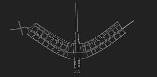

# My Hometown Project

## About
Project showcases some information about my hometown, Brasilia.
It's main objective is to practice how to use semantic html elements and css attributes to create a simple but functional website.

### Features
- <strong>Navigation:</strong> 
    - You can change between pages using the main navigation located at the top of the pages. 
    - In the landing page, there ar also links in the content text that will redirect you to the others pages.
    - In the sighseeing page, there is a second navigation fixed at the top that will redirect to other sections within the page.  

## Author
- Design and Development by Natalia Oliveira

## Credits
- Images were taken from unsplash, wikipedia and google;
- History facts were redacted by chatgpt;
- Curiosities were by the project author;